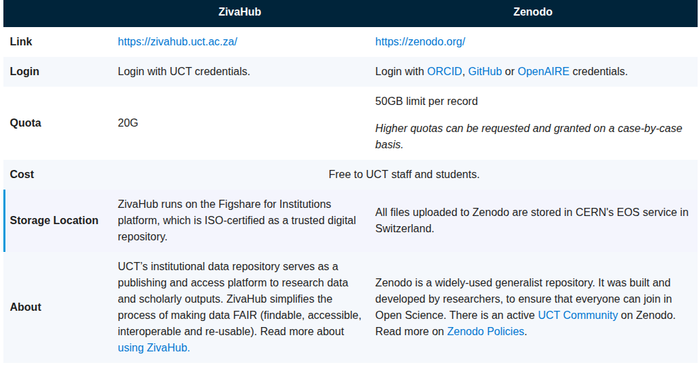

## Research Data Store (RDS)

Managed by ICTS,  this infrastructure was established to provide huge pools of research data storage at a discounted price. Secure access to your research data is provided via UCT credentials and data can be accessed from anywhere in the world. 

The data is stored on Dell MD3060 storage arrays, hosted in the highly secure Upper Campus Data Centre. A copy of the data is replicated to UCT storage array in the Neotel (Liquid Telecom) data centre in Diep River, Cape Town.

## Online storage in a repository

Researchers can store and publish research data in an online repository. All recommended repositories will generate a DOI (Digital Object Identifier), which is a secure and persistent identifier. This makes it easier for researchers to comply with institutional, NRF and other funder requirements. Once data is uploaded, researchers can assign licenses and control how their research outputs are accessed.

Importantly, UCT doesn’t mandate a specific repository, and depending on the discipline, there are various discipline-specific repositories to choose from. UCT’s recommended online repository is ZivaHub, which we offer support and guidance for. ZivaHub (Figshare) is an excellent generalist repository and is suitable for the widest range of data types and formats.  

Some funders may require using a specific repository, and other repositories may be more attractive because they are discipline-specific. We recommend using  www.re3data.org, an international registry of research data repositories, to search for a suitable alternative repository.

