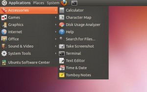

## Logging In

Once you have been [granted an account](./access-accounts.md) you will need to login to the head node of one of the clusters.

!!! tip "Essential knowledge: Linux command line"

    All the clusters run Linux and you will need to be comfortable working with the command prompt. If you have had no experience with the Linux command line interface we have [training material](../training/courses.md) as well as a how to guide. Alternately there are [numerous web articles](https://www.google.com/search?btnG=1&pws=0&q=+how+to+use+the+Linux+command+prompt&gws_rd=ssl) on how to use the Linux command prompt.

=== "Windows"

    1. You will need to download an ssh client such as PuTTY. [Download](http://www.chiark.greenend.org.uk/~sgtatham/putty/download.html) the 64-bit x86 executable now.

        

    2. Save putty.exe to your C: drive and run it.

    3. Enter the hostname of the cluster, for example `hpc.uct.ac.za`, and click `Open`.

        !!! note "Cluster name"

            Our cluster has two names that can be used interchangeably:

            - `hpc.uct.ac.za`
            - `hex.uct.ac.za`

        
        

    4. Type in your username the black PuTTY screen
    5. Press enter
    6. Type in your password 
    7. Press enter (__Note__: _The password characters will not appear when you type them, this is a security feature. Therefore it is important to pay attention when you are entering your password and be mindful of capitalisation)_.

        

        !!! tip "Linux commands"

            You can learn basic Linux commands for using the cluster in our [Linux cheatsheet](../ref/linux-cheatsheet.md).
    
    8. You are successfully logged in if the prompt changes to `your_username@srvslshpc001`.


=== "Mac"

    Most Apple MAC OS’s come with commands for logging in preinstalled. 
    
    1. From `Applications` > `Utilities` select `Terminal`.

        

    2. In the Terminal application (black screen) type the following:

        ```
        ssh username@hpc.uct.ac.za
        ```

        !!! note "Cluster name"

            Our cluster has two names that can be used interchangeably:

            - `hpc.uct.ac.za`
            - `hex.uct.ac.za`
    3. Type in your username
    4. Press enter
    5. Type in your password 
    6. Press enter (__Note__: _The password characters will not appear when you type them, this is a security feature. Therefore it is important to pay attention when you are entering your password and be mindful of capitalisation)_.
    7. You are successfully logged in if the prompt changes to `your_username@srvslshpc001`.

        !!! tip "Linux commands"

            You can learn basic Linux commands for using the cluster in our [Linux cheatsheet](../ref/linux-cheatsheet.md).

=== "Linux"

    Most Linux distributions come with commands for logging in preinstalled. 

    1. Open the terminal

        

    2. Log in with the following command:
        ```
        ssh username@hpc.uct.ac.za
        ```

        !!! note "Cluster name"

            Our cluster has two names that can be used interchangeably:

            - `hpc.uct.ac.za`
            - `hex.uct.ac.za`
    3. Type in your username
    4. Press enter
    5. Type in your password 
    6. Press enter (__Note__: _The password characters will not appear when you type them, this is a security feature. Therefore it is important to pay attention when you are entering your password and be mindful of capitalisation)_.
    7. You are successfully logged in if the prompt changes to `your_username@srvslshpc001`.

        !!! tip "Linux commands"

            You can learn basic Linux commands for using the cluster in our [Linux cheatsheet](../ref/linux-cheatsheet.md).


## Logging Out


The same process for logging out of the HPC can be followed regardless of the operating system of your own computer.

To exit from the cluster type `exit`.

```
exit
```

