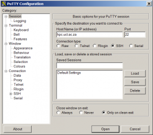
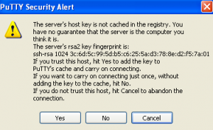

There are three easy steps to becoming an HPC user:

1. [Applying for an account](#eligibility)
2. [Logging in and out](#logging-in)
3. Understanding the [filesystems and quotas](#scratch-for-computing)

Once you have followed these three steps, you are ready to start [submitting jobs](../jobs/submit.md)!

---


## :material-numeric-1-box: APPLYING FOR AN ACCOUNT

### Eligibility

You will need to have an active University of Cape Town staff or student account. 

!!! failure "Third party accounts" 
    Third Party accounts are no longer permitted on the cluster.

### Before applying

Before applying please read the [UCT eResearch HPC Acceptable Use Policy](../policy/aup.md) (AUP).

[:fontawesome-solid-glasses: Read AUP now](https://uct.service-now.com/sp?id=sc_cat_item&sys_id=a1ba9c92db8d405080a66def4b96199d){ .md-button .md-button--primary }


### Your PI's responsibility

Before your account can be created your supervisor must approve the request.

When selecting your PI from the dropdown list you must select the correct PI account. 
Your PI will receive an automated email asking for their approval along with steps on how to approve the request. They must reply to this request __from their UCT email account__.

Once they have responded to the approval email from their UCT email address the system will automatically forward your request to the HPC team who will then create your account.

!!! note "Streamlining the process"

    We recommend contacting your PI once you have applied for access to ensure that they have received the approval email.   

!!! failure "Common causes for failed applications"

    - If you select your PI’s old student account then the application will fail
    - If there is an auto-forward on your PI’s email to another account the approval will fail.
    - If your PI does not respond to the request within 2 weeks the application will fail.

### Application 

To apply for an account you will need to login to the [UCT ServiceNow portal](https://uct.service-now.com/sp). 


[:fontawesome-solid-pen-to-square: HPC Application Form](https://uct.service-now.com/sp?id=sc_cat_item&sys_id=a1ba9c92db8d405080a66def4b96199d){ .md-button .md-button--primary }

!!! tip "Logging into ServiceNow"

    Remember to log into the ServiceNow Portal with your __UCT credentials__.

!!! warning "ServiceNow Portal Error"

    If you receive the message _“You are either not authorized or record is not valid.”_ then please login to the ServiceNow portal by selecting the Login link at the top right on the page, and __login with your UCT credentials__.

## :material-numeric-2-box: LOGGING IN & OUT

### Logging in

Once you have been [granted an account](./access-accounts.md) you will need to login to the head node of one of the clusters.

!!! tip "Essential knowledge: Linux command line"

    All the clusters run Linux and you will need to be comfortable working with the command prompt. If you have had no experience with the Linux command line interface we have [training material](../training/courses.md) as well as a how to guide. Alternately there are [numerous web articles](https://www.google.com/search?btnG=1&pws=0&q=+how+to+use+the+Linux+command+prompt&gws_rd=ssl) on how to use the Linux command prompt.

=== "Windows"

    1. You will need to download an ssh client such as PuTTY. [Download](http://www.chiark.greenend.org.uk/~sgtatham/putty/download.html) the 64-bit x86 executable now.

        

    2. Save putty.exe to your C: drive and run it.

    3. Enter the hostname of the cluster, for example `hpc.uct.ac.za`, and click `Open`.

        !!! note "Cluster name"

            Our cluster has two names that can be used interchangeably:

            - `hpc.uct.ac.za`
            - `hex.uct.ac.za`

        
        

    4. Type in your username the black PuTTY screen
    5. Press enter
    6. Type in your password 
    7. Press enter (__Note__: _The password characters will not appear when you type them, this is a security feature. Therefore it is important to pay attention when you are entering your password and be mindful of capitalisation)_.

        

        !!! tip "Linux commands"

            You can learn basic Linux commands for using the cluster in our [Linux cheatsheet](../ref/linux-cheatsheet.md).
    
    8. You are successfully logged in if the prompt changes to `your_username@srvslshpc001`.


=== "Mac"

    Most Apple MAC OS’s come with commands for logging in preinstalled. 
    
    1. From `Applications` > `Utilities` select `Terminal`.

        

    2. In the Terminal application (black screen) type the following:

        ```
        ssh username@hpc.uct.ac.za
        ```

        !!! note "Cluster name"

            Our cluster has two names that can be used interchangeably:

            - `hpc.uct.ac.za`
            - `hex.uct.ac.za`
    3. Type in your username
    4. Press enter
    5. Type in your password 
    6. Press enter (__Note__: _The password characters will not appear when you type them, this is a security feature. Therefore it is important to pay attention when you are entering your password and be mindful of capitalisation)_.
    7. You are successfully logged in if the prompt changes to `your_username@srvslshpc001`.

        !!! tip "Linux commands"

            You can learn basic Linux commands for using the cluster in our [Linux cheatsheet](../ref/linux-cheatsheet.md).

=== "Linux"

    Most Linux distributions come with commands for logging in preinstalled. 

    1. Open the terminal

        

    2. Log in with the following command:
        ```
        ssh username@hpc.uct.ac.za
        ```

        !!! note "Cluster name"

            Our cluster has two names that can be used interchangeably:

            - `hpc.uct.ac.za`
            - `hex.uct.ac.za`
    3. Type in your username
    4. Press enter
    5. Type in your password 
    6. Press enter (__Note__: _The password characters will not appear when you type them, this is a security feature. Therefore it is important to pay attention when you are entering your password and be mindful of capitalisation)_.
    7. You are successfully logged in if the prompt changes to `your_username@srvslshpc001`.

        !!! tip "Linux commands"

            You can learn basic Linux commands for using the cluster in our [Linux cheatsheet](../ref/linux-cheatsheet.md).


### Logging out

The same process for logging out of the HPC can be followed regardless of the operating system of your own computer.

To exit from the cluster type `exit`.

```
exit
```

---

## :material-numeric-3-box: UNDERSTANDING FILE SYSTEMS & QUOTAS


### `/scratch` for Computing

`/scratch` is mounted on all worker nodes. The file system is intended to provide fast disk I/O. The `/scratch` file system is shared space and is intended for temporary processing, not long term storage. Should the `/scratch` file system run out of space all users are affected.

Users are granted a default quota of 100GB in `/scratch` and are requested to apply for additional storage by [e-mailing the HPC administrators](../help/support.md/#Contact-us). 

#### What should you do on `/scratch`?

This is the preferred place to put any intermediate files required while a job is executing. 

We encourage users who have large datasets to upload them directly to `/scratch`, not `/home`.

The output of all computation should also be directed to `/scratch`.


!!! warning "`scratch` is not backed up"

    `/scratch` is purposely built as a computational work space and is __not intended for long term storage__.

    Any data which is lost from `/scratch` cannot be recovered.


#### What should you __not__ do on `scratch?

`scratch` should not be used for long-term storage. Users are expected to move their data from `/scratch` to long term storage as part of their workflow. 

Scripts and other data that cannot easily be replicated should not be stored in `/scratch`.

Data that you wish to keep must be downloaded and removed from `/scratch`.


### `/home` for XYZ

Please note that you may only store 10GB of data on `/home`.

## [NEXT: Submitting your first job](../jobs/submit)