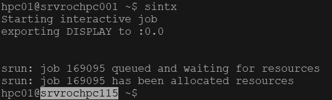

# Interactive Jobs

An interactive job gives you command line access to a worker node. 

From the head node type:

```
    sintx
```

The cluster will indicate that you are starting an interactive job and your prompt will change to that of a worker node.  In addition the hostname format changes to black on white text:



Now any command you type is executed on that node. If you do not see the text “_Starting interactive job_” then you are still on the head node and should not run any heavy load processes.

Unlike `salloc` your commands do not need to be prefaced with `srun` unless you are running OpenMPI code.

Type `exit` to end the job and you will return to the head node.

You can specify additional cluster parameters with the sintx command just as in an sbatch file:

```
      sintx --ntasks=20 --account=maths --partition=ada
```

Account and partition parameters are not mandatory unless you have access to more than one partition.

In addition `sintx` automatically creates a `DISPLAY` environment variable should you wish to export a graphical display back to your workstation. You will however need to be running an Xclient on your desktop.

## Advanced node selection

The _ada_ partition consists of several tranches of worker nodes purchased over time.  The characteristics of these nodes are uniform within their tranches, however the 100 series are more powerful than the 200 series.  The architecture of these nodes can be viewed here.  By default your jobs will target the 100 range in the ada partition.  When this fills up jobs will spill over into the 200 series. If you want to avoid this and rather have your job queue until a faster node is available you must use the following directive:

```
    #SBATCH --constraint=large
```

The 200 series have a slightly better RAM\core ratio, if you want your jobs to target these nodes then specify the following directive:

```
    #SBATCH --constraint=small
```